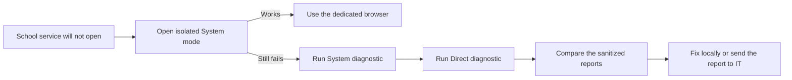

# XJTLU Access Helper

[](https://github.com/FranklinNexus/xjtlu-access-helper)
[](https://github.com/FranklinNexus/xjtlu-access-helper/actions)
[](SECURITY.md)
[](LICENSE)

XJTLU Access Helper is a privacy-conscious Windows utility for opening XJTLU
web services in an isolated Chromium profile and diagnosing common access
failures without changing the user's normal browser, extensions, or global
proxy settings.

**中文简介：** 当 Learning Mall 或学校邮箱白屏、无限转圈、登录跳转失败时，先用一个
不加载日常扩展的独立浏览器环境访问；如果仍然失败，再生成不含账号和登录令牌的本地
诊断报告，区分浏览器、代理/VPN、DNS、TLS、WAF/地区策略或学校服务故障。

It currently supports:

- Learning Mall Core and the XJTLU authentication chain
- XJTLU Webmail and its Microsoft identity-provider chain
- The public XJTLU website

This is an independent community project and is not an official XJTLU product.

[Simplified Chinese documentation](README.zh-CN.md)

## The 30-second path



Most browser-side failures need only the first step. Diagnostics are for cases
where isolation does not solve the problem.

## Quick start

1. Download the [latest release ZIP](https://github.com/FranklinNexus/xjtlu-access-helper/releases/latest),
   then extract it to a normal folder. Cloning the repository also works.
2. Double-click `XJTLU-Access-Helper.cmd` in the extracted folder.
3. Start with the isolated **System network** option for the service you need.
4. If it still fails, run both System and Direct diagnostics and compare the
   generated reports.

No administrator privileges or installation are required. The `.cmd` wrapper
uses a process-only PowerShell execution-policy override; it does not change
the computer's PowerShell policy.

## Optional automatic handoff

Use the [automatic browser handoff](auto-open/README.zh-CN.md) when you want
school URLs typed in a normal Edge/Chrome tab to open in the isolated browser
automatically. It is opt-in, matches only the listed XJTLU hosts, and can be
paused from the extension toolbar icon.

## Typical problems it addresses

- The authentication page stays blank or spins forever.
- Learning Mall works in one browser but not another.
- Webmail redirects repeatedly between XJTLU and Microsoft sign-in.
- A proxy, VPN, or accelerator changes the route unexpectedly.
- A hotel, airport, or campus captive portal intercepts the request.
- DNS resolves incorrectly, TCP 443 is blocked, or TLS validation fails.
- A gateway returns 401, 403, 451, 429, or a server-side 5xx response.
- The network path is healthy but stale cookies, site storage, or extensions
  break the page.

## What it changes

The helper creates dedicated browser data under:

```text
%LOCALAPPDATA%\XJTLU-Access-Helper\Profiles
```

The isolated browser:

- starts with extensions disabled;
- does not enable browser sync;
- has fresh cookies and site storage;
- keeps its session separate from the normal browser profile;
- uses either the normal system network or an app-local no-proxy mode.

It does **not** change the normal browser profile, global proxy, DNS, firewall,
VPN, trusted certificates, antivirus, or Windows security settings.

## Modes

| Mode | Purpose | Scope |
| --- | --- | --- |
| System | First choice; follows the normal Windows proxy/network path | Isolated browser only |
| Direct | Ignores browser/system HTTP proxy settings for comparison | Isolated browser only |

Direct mode cannot bypass a TUN/TAP/WireGuard-style VPN adapter because that
routing occurs below the browser. It is a diagnostic comparison, not a policy
bypass.

## Diagnostic coverage

The generated report checks DNS, TCP 443, TLS certificate validation, HTTP GET
status, sanitized redirect chains, server/local clock skew, Windows proxy
signals, proxy environment-variable presence, and VPN-technology hints.

| Finding | Likely layer | Suggested next step |
| --- | --- | --- |
| DNS failure | Resolver, filtered DNS, captive network | Compare System/Direct and try a trusted network |
| TCP 443 failure | Firewall, VPN, routing, captive portal | Check network policy without disabling security globally |
| TLS failure | Wrong clock, TLS inspection, certificate problem | Sync Windows time and inspect the trusted network path |
| HTTP 407 | Proxy authentication | Authenticate to the proxy or compare Direct mode |
| HTTP 401/403/451 | WAF, geo-IP, access policy | Ask XJTLU IT to inspect gateway logs at the report time |
| HTTP 429 | Rate limiting | Wait and ask IT to review the source network if persistent |
| HTTP 5xx | School or identity-provider outage | Retry later and report the timestamp |
| Unexpected redirect | Captive portal, DNS/proxy interception | Complete captive-portal login and rerun |
| Network healthy, browser broken | Extension, cookies, storage, stale browser state | Use the isolated browser or reset only its profile |
| Login fails after credentials | Account, MFA, Conditional Access, SAML/OAuth callback | Contact IT with the sanitized report and visible error |

## Privacy model

Reports intentionally do not collect:

- usernames, passwords, MFA codes, or account identifiers;
- cookies, local/session storage, browser history, or saved passwords;
- public IP address, Wi-Fi name, MAC address, or device name;
- OAuth, OIDC, or SAML query parameters.

Redirect URLs are stored only as scheme, host, and path. Proxy values are not
recorded; only the presence of a proxy/PAC/environment setting is reported.
Reports remain local under `%LOCALAPPDATA%\XJTLU-Access-Helper\Reports` unless
the user chooses to share them.

Review a report before sharing it. Although the default report is minimized,
local security software can add environment-specific error text.

## Command-line use

```powershell
# Open Learning Mall in the isolated profile
.\XJTLU-Access-Helper.ps1 -Action Launch -Service learning-mall -NetworkMode System

# Compare a browser-level direct connection
.\XJTLU-Access-Helper.ps1 -Action Launch -Service learning-mall -NetworkMode Direct

# Create a report without opening Notepad
.\XJTLU-Access-Helper.ps1 -Action Diagnose -Service webmail -NetworkMode System -NoOpenReport

# Reset only the helper's isolated browser cookies and sessions
.\XJTLU-Access-Helper.ps1 -Action Reset

# Validate configuration and local browser discovery
.\XJTLU-Access-Helper.ps1 -Action SelfTest
```

Supported service IDs are `learning-mall`, `webmail`, and `main-site`.

## Adding services

Edit `services.json` and add an HTTPS-only service entry containing:

- a stable `id`;
- a display `name`;
- the normal `launchUrl`;
- one or more pre-login `probeUrls`;
- every legitimate redirect host in `allowedRedirectHosts`.

Never add a URL containing a real SAML request, OAuth code, access token,
session identifier, or user-specific query parameter.

## Reset and recovery

The Reset action deletes only the exact directory
`%LOCALAPPDATA%\XJTLU-Access-Helper\Profiles`. It preserves diagnostic reports
and never touches the normal Edge, Chrome, or Brave profiles. Close helper
browser windows before resetting.

## Known limits

- The tool cannot determine whether a username, password, or MFA response is
  valid and never attempts to do so.
- It cannot bypass school geo-IP, WAF, account, or Conditional Access policy.
- It does not automatically discover the user's public IP or country because
  that would require contacting a third-party service.
- A trusted HTTPS-inspection product may still produce a valid TLS connection;
  the certificate issuer is recorded so the user or IT can review it.
- Live endpoints can change. Keep `services.json` current and test changes
  against official XJTLU entry points.

## Security and support

See [SECURITY.md](SECURITY.md) before reporting a vulnerability. For an access
incident, use the template in [docs/REPORTING-TO-IT.md](docs/REPORTING-TO-IT.md).
For community support and product boundaries, see [SUPPORT.md](SUPPORT.md).

## License

MIT. See [LICENSE](LICENSE).
