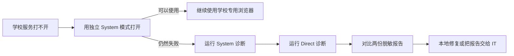

# XJTLU Access Helper

[](https://github.com/FranklinNexus/xjtlu-access-helper)
[](https://github.com/FranklinNexus/xjtlu-access-helper/actions)
[](SECURITY.md)
[](LICENSE)

XJTLU Access Helper 是一个注重隐私的 Windows 工具，用独立的 Chromium
浏览器配置打开西浦服务，并在不修改日常浏览器、扩展和系统代理的前提下定位访问问题。

目前支持：

- Learning Mall Core 与西浦统一身份认证链路
- 西浦 Webmail 与微软身份认证链路
- 西浦官方网站

这是社区独立项目，不是西交利物浦大学官方产品。

## 30 秒处理路径



多数浏览器侧问题在第一步就能解决；只有隔离环境仍然失败时才需要诊断。

## 快速使用

1. 下载[最新版 ZIP](https://github.com/FranklinNexus/xjtlu-access-helper/releases/latest)，
   解压到普通文件夹；也可以克隆完整项目目录。
2. 在解压后的文件夹中双击 `XJTLU-Access-Helper.cmd`。
3. 优先选择对应服务的“isolated, system network”模式。
4. 如果仍然失败，分别运行 System 和 Direct 诊断，对比生成的报告。

不需要管理员权限，也不需要安装。CMD 启动器仅对当前 PowerShell 进程使用执行策略例外，
不会修改 Windows 的 PowerShell 设置。

## 它会做什么

工具会在以下目录创建学校专用浏览器数据：

```text
%LOCALAPPDATA%\XJTLU-Access-Helper\Profiles
```

这个浏览器环境会：

- 禁用扩展；
- 禁用浏览器同步；
- 使用全新的 Cookie 与站点存储；
- 与日常浏览器登录状态完全隔离；
- 根据选择使用系统网络或仅对该浏览器生效的直连模式。

它不会修改日常浏览器配置、全局代理、DNS、防火墙、VPN、系统证书、杀毒软件或
Windows 安全设置。

## 两种网络模式

| 模式 | 用途 | 影响范围 |
| --- | --- | --- |
| System | 首选，沿用 Windows 当前代理与网络路径 | 仅学校专用浏览器 |
| Direct | 忽略浏览器/系统 HTTP 代理，用于对照 | 仅学校专用浏览器 |

Direct 模式无法绕过 TUN、TAP、WireGuard 等系统级虚拟网卡，因为这类路由发生在
浏览器以下。它用于诊断，不用于绕过学校或网络策略。

## 可以定位的问题

诊断报告会检查 DNS、TCP 443、TLS 证书校验、HTTP GET 状态、脱敏后的跳转链、
服务器与本机时钟偏差、Windows 代理信号、代理环境变量是否存在，以及 VPN 技术特征。

| 结果 | 常见原因 | 建议 |
| --- | --- | --- |
| DNS 失败 | DNS 故障、过滤或强制门户 | 对比 System/Direct，换可信网络测试 |
| TCP 443 失败 | 防火墙、VPN、路由或强制门户 | 检查网络策略，不要全局关闭安全软件 |
| TLS 失败 | 系统时间错误、HTTPS 检查或证书异常 | 同步时间并检查可信网络路径 |
| HTTP 407 | 代理要求认证 | 登录代理或对比 Direct 模式 |
| HTTP 401/403/451 | WAF、地区或访问策略 | 请学校 IT 按报告时间查询网关日志 |
| HTTP 429 | 限流 | 等待后重试，持续出现时联系 IT |
| HTTP 5xx | 学校或身份平台故障 | 稍后重试并提交发生时间 |
| 跳转到未知域名 | 强制门户、DNS/代理劫持 | 完成网络认证后重新诊断 |
| 网络正常但浏览器异常 | 扩展、Cookie、存储或旧配置 | 使用独立浏览器或只重置它的配置 |
| 输入账号后失败 | 账号、MFA、条件访问、SAML/OAuth 回调 | 把脱敏报告和页面错误交给 IT |

常见现象包括：认证页白屏或无限转圈、不同浏览器表现不一致、学校邮箱在微软登录页
反复跳转、代理/VPN/加速器改变路由、酒店或校园强制门户、DNS/TLS 故障，以及网关
返回 401、403、451、429 或 5xx。

## 隐私边界

报告不会收集：

- 用户名、密码、验证码或账号标识；
- Cookie、本地/会话存储、浏览历史或已保存密码；
- 公网 IP、Wi-Fi 名称、MAC 地址或设备名称；
- OAuth、OIDC 或 SAML 查询参数。

跳转 URL 只保留协议、域名和路径。代理只记录“是否存在”，不记录代理地址。
报告默认保存在 `%LOCALAPPDATA%\XJTLU-Access-Helper\Reports`，除非用户主动分享，
否则不会上传。

分享前仍应查看报告，因为本地安全软件产生的错误文本可能包含环境信息。

## 重置

Reset 只删除 `%LOCALAPPDATA%\XJTLU-Access-Helper\Profiles`，保留诊断报告，
不会触碰日常 Edge、Chrome 或 Brave 配置。重置前应关闭所有学校专用浏览器窗口。

## 限制

- 工具不会验证或代填账号、密码和 MFA。
- 工具不能绕过学校的地区、WAF、账号或条件访问策略。
- 为避免把公网 IP 发送给第三方，工具不会自动判断当前出口国家/地区。
- 合法的 HTTPS 检查软件可能仍通过 TLS 校验；报告会记录证书签发者供人工判断。
- 学校入口可能变化，更新 `services.json` 时应以官方入口为准。

漏洞报告见 [SECURITY.md](SECURITY.md)，向学校 IT 报障可使用
[docs/REPORTING-TO-IT.md](docs/REPORTING-TO-IT.md) 模板。
社区支持与产品边界见 [SUPPORT.md](SUPPORT.md)。

本项目采用 MIT 许可证。
